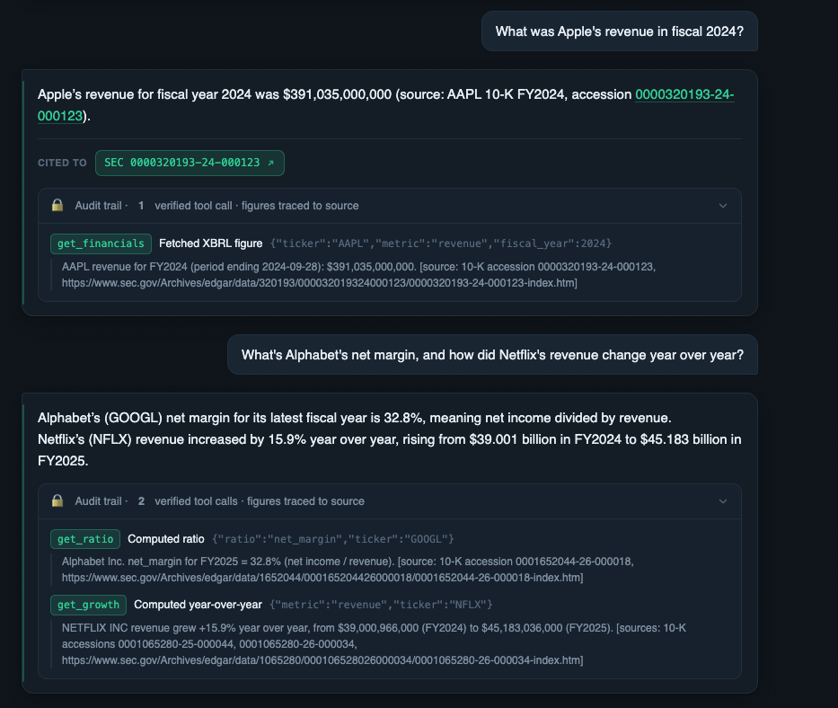
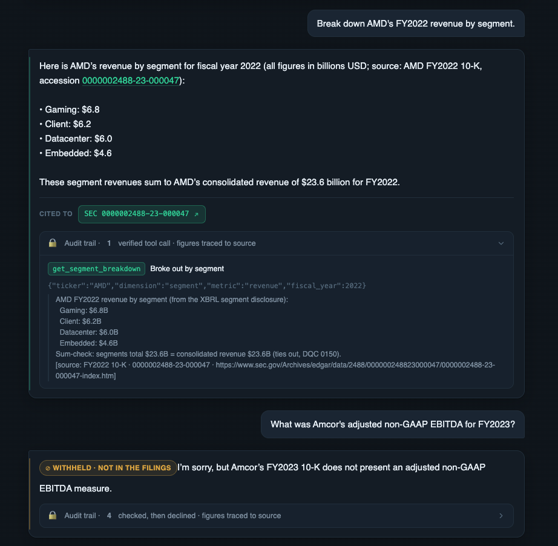

# Vouch

*Financial answers you can audit — a finance-grade tool-calling agent over SEC filings and your own documents.*

[](https://github.com/Zhonghui-li/sec-filing-agent/actions/workflows/eval.yml)





Answers financial questions about **any U.S. public company** from its SEC filings, built to the
**finance bar**: a wrong or unsupported number is unacceptable.

> **Validated on FinanceBench**, an external benchmark we didn't write:
> **addressable coverage 44% → 87% over five data-driven iterations, hallucination rate ≈ 0.**
> → [full brief](eval/financebench/REPORT.md)

## Architecture

```
                     user question
                          │
                          ▼
                 ┌──────────────────┐
                 │   Agent (LLM)    │   routes to a tool
                 └───┬──────────┬───┘
             numbers │          │ narrative
                     ▼          ▼
        ┌─────────────────┐  ┌────────────────────┐
        │ XBRL tools      │  │ search_filings     │
        │ figures·ratios· │  │ pgvector dense     │
        │ growth·formulas │  │ retrieval, EDGAR   │
        └────────┬────────┘  └─────────┬──────────┘
          figures │                    │ cited passages
                  └──────────┬─────────┘
                             ▼
                 ┌────────────────────────┐
                 │  Output guardrail      │  a number must trace
                 │                        │  to a tool, else abstain
                 └───────────┬────────────┘
                             ▼
               answer + clickable EDGAR citations

   wrapped by a 3-layer eval:  deterministic CI gate ·
   domain judge (κ=0.76) ·  FinanceBench (44 → 87%)
```

Two paths, one bar. Exact figures come from **deterministic tools over XBRL** (the LLM never does
arithmetic on financials); narrative goes through **retrieval** with citations. An **output
guardrail** blocks any number that doesn't trace to its source: an XBRL tool, or (for an event
figure XBRL doesn't carry, like a debt issuance) a cited 8-K passage the number matches verbatim.

## The finance bar

| Rule | How |
|---|---|
| **Numbers only from tools** | every figure from structured XBRL, never LLM arithmetic |
| **Every claim cited** | a clickable EDGAR link to the source filing |
| **Abstains, never fabricates** | a structured signal when a metric isn't reported or is out of scope |
| **Same bar for your docs** | uploaded statements → table-cell extraction, cell-level citations |

Covers **23 statement line-items + 18 ratios**, annual or by quarter, plus any spelled-out formula,
for any public company. Delisted or renamed firms resolve by **name** (Activision, Square→Block),
not a dead ticker.

## Example

```
Q: How did NVIDIA's revenue change year over year, and what does management attribute it to?
A: +65.5% YoY, from $130.5B (FY2025) to $215.9B (FY2026), driven by data-center AI demand.
   🔧 get_growth(revenue, NVDA) · search_filings(NVDA)   [source: 10-K 0001045810-26-000021 → sec.gov/…]

Q: What is Activision's FY2019 fixed-asset turnover?
A: 24.26x (revenue / average net PP&E).   🔧 get_ratio(fixed_asset_turnover, "Activision Blizzard", 2019)
   (delisted — resolved by name, not the retired ATVI ticker)

Q: What is JPMorgan's gross profit?
A: 🔧 get_financials(JPM, gross_profit) → not reported · abstain(not_reported)
   JPMorgan doesn't report gross profit (banks have no cost-of-goods line).
```

## Tools

| Tool | What it does |
|---|---|
| `get_financials` | an exact figure from XBRL (full-year or a specific quarter), any public company, fetched live |
| `get_ratio` | 18 standard ratios from fixed formulas, the right base metric baked in |
| `get_growth` | YoY change, always consecutive years, so no multi-year span is mislabeled as YoY |
| `compute_formula` | a spelled-out formula, **Program-of-Thought**: the model writes it once, code fetches every figure and evaluates, so the model never transcribes a number |
| `search_filings` | qualitative context from a 10-K (any fiscal year), recent 10-Q MD&A, and 8-K events, via pgvector dense retrieval |
| `abstain(reason)` | a structured, machine-readable refusal |

*Ratios and growth are computed, not assembled.* LLMs reliably pick the **wrong base metric**: total
liabilities for "debt", period-end vs average assets for ROA (both surfaced by FinanceBench). Baking
the conventions into fixed formulas removes that whole class of error.

## Evaluation — the part most agent demos skip

**1 · Internal CI gate.** 84 cases: numeric answers self-grounded from XBRL (correct by construction)
over 7 curated companies, plus 27 narrative cases with gold evidence across ~20 companies. Scored by
a complementary suite (`numerical`, `grounded`, `citation`, `tool` trajectory, `abstain`,
`context_recall`, `forbid` injection); the 9 deterministic metrics gate CI, 3 LLM-judge metrics monitor only.

**2 · Calibrated domain judge.** A rubric judge that scores honest hedging / appropriate abstention
as *good*, calibrated against a balanced human-labeled set including *subtle* hallucinations:
**Cohen's κ = 0.76**, with **zero false-positives on hedged/abstaining answers**. Fixes the generic
metric's bias (JPMorgan capital answer: generic relevancy `0.0` vs domain judge `1.0`).

**3 · External benchmark — [FinanceBench](https://github.com/patronus-ai/financebench) (Patronus AI).**
150 questions / 32 companies we did *not* write. **Addressable coverage 44% → 87% across five
iterations, hallucination ≈ 0** (numeric). The qualitative side is scored too — **78% answered-correct
where the evidence is in indexed narrative** (real agent, year-controlled). Reproducible harness with
a tracked runs log.
→ [`eval/financebench/`](eval/financebench/) · [REPORT.md](eval/financebench/REPORT.md)

> Built eval-driven: the eval surfaced the failures that drove the agent. It once *guessed* fiscal
> years, *substituted revenue as a proxy for gross profit*, and *over-refused* answerable questions.
> Several "failures" were scorer bugs, not agent bugs; telling the two apart is the core skill.

## Bring your own data

Upload a statement (an internal report, a non-public company) and the agent answers from it, the same
bar with no XBRL. [Docling](https://github.com/docling-project/docling) structured extraction reads
figures from **table cells**, never prose; citations are **cell-level** (`filename · page · row/col`)
and deep-link to the PDF page; documents are **per-user isolated** and scoped so a number is never
attributed to the wrong file. Heavy ingestion runs async in an isolated venv.
→ [`ingest/README.md`](ingest/README.md)

## Run it

```bash
pip install -r requirements.txt

python -m pytest tests/                                                   # deterministic tests (no keys)
DATABASE_URL=… OPENAI_API_KEY=… uvicorn service.app:app --port 8100       # demo at http://localhost:8100
DATABASE_URL=… OPENAI_API_KEY=… python -m agents.sec_agent "How did NVIDIA's revenue change YoY?"
```

The service exposes `/ask` (answer + citations + a collapsible **audit trail** of tool calls),
`/export` (deterministic CSV of metrics × years), `/upload` + `/file/{doc_id}` (private docs), and an
**OpenAI-compatible** `/v1/chat/completions` that drops into open-webui / LibreChat. Default model
**o4-mini**. Deployed on Cloud Run with `max-instances=1`, so the in-memory daily quota is an exact
global cap.

## Under the hood

- **Numbers**: SEC `companyfacts` XBRL, live for any company; 7 companies cached in
  `data/financials.json` as the deterministic eval baseline.
- **Narrative**: 10-K sections, recent 10-Q MD&A, and recent 8-K events (each 8-K chunked per item)
  via `edgartools` → **pgvector**, indexed live on first query for **any** company and **any fiscal
  year** (a historical question retrieves that year's 10-K, not just the latest; curated set pre-cached).
  The lazy cache is bounded by an LRU + freshness TTL.
- **Tag drift**: a company migrates the same line to a different XBRL tag across years; the extractor
  merges candidate tags, and a footnote component can never substitute for the total line.
- **As-reported basis**: returns the figure as originally filed (matching the source and the
  benchmark), flags a later restatement, and never mixes bases across years.

> Reuses retrieval and eval-in-CI engineering from
> [Slug Advisor](https://github.com/Zhonghui-li/Agentic-RAG), re-pointed from course advising to
> financial-document analysis and raised to the finance bar.
